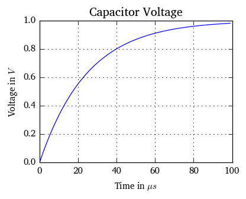

Example: Calculating an RC Circuit
==================================

.. code:: python

    # Imports
    import PhysicalQuantities as pq
    %load_ext PhysicalQuantities.ipython
    from PhysicalQuantities.constants import eps0
    %precision 2

.. parsed-literal::

    The PhysicalQuantities.ipython extension is already loaded. To reload it, use:
      %reload_ext PhysicalQuantities.ipython

We have a simple RC circuit, consisting of a voltage source :math:`U_0`,
a resistor with a value :math:`R` and a capacitor with value :math:`C`:

Let's start with calculating the capacitance of a simple parallel plate
capacitor:

.. code:: python

    A = 1 mm * 1 mm # Plate area
    d = 1 um        # Plate distance
    eps_r = 3       # Permittivity of dielectric material
    C  = (eps0*eps_r*A) / d

The capacitor value is :math:`C` =

.. raw:: html

   

26.562564 :math:`\text{pF}`

.. raw:: html

   

26.562564 :math:`\text{pF}`

The resistor is a thick film resistor:

.. code:: python

    rho = 10 Ohm * 1 mm # Material resistivity
    t = 10 um           # Sheet thickness
    L = 150 um          # Structure length
    W = 10 um           # Structure width
    Rs = rho / t 
    R = Rs * L / W
    disp("Resistor value $R$ = %s" % R.kOhm)

Resistor value :math:`R` = 15.00 kOhm

Calculate transient response of circuit
---------------------------------------

.. code:: python

    u0 = 1. V
    tau = 1/(R*C)
    t = pq.linspace(0,4/tau,100).us

.. code:: python

    i0 = u0/R
    i = (i0*e**(-t*tau)).uA
    disp("Initial current is $i_0$ = %s" % i0.uA)

Initial current is :math:`i_0` = 66.67 uA

Plot Current and Voltage over Time
----------------------------------

.. code:: python

    plot(t.us_,i.uA_)
    grid()
    title('Circuit Current')
    xlabel('Time in %s' % t.unit._repr_latex_())
    ylabel('Current in %s' %  i.unit._repr_latex_());

.. image:: pq-example_files/pq-example_13_0.png

.. code:: python

    uc = u0 - i*R
    plot(uc.V_)
    title('Capacitor Voltage')
    grid()
    xlabel('Time in $\mu s$')
    ylabel('Voltage in $V$');

