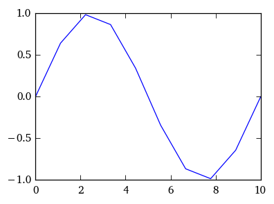

PhysicalQuantities and Numpy
============================

Units can be mixed with numpy arrays:

.. code:: python

    t = np.arange(10) * 1 s
    print(t)

.. parsed-literal::

    [0 1 2 3 4 5 6 7 8 9] s

Array indexing and slicing is supported:

.. code:: python

    print(t[1:4])
    a = np.random.rand(3,4) * 1 m
    print(a)
    print(a[2][3])

.. parsed-literal::

    [1 2 3] s
    [[ 0.39  0.16  0.19  0.65]
     [ 0.39  0.47  0.21  0.16]
     [ 0.35  0.34  0.18  0.28]] m
    0.28352011318205039 m

Assignment of array elements is supported:

.. code:: python

    a = np.linspace(0,10,10) * 1m
    a[0] = 3 m
    print(a)

.. parsed-literal::

    [  3.           1.11111111   2.22222222   3.33333333   4.44444444
       5.55555556   6.66666667   7.77777778   8.88888889  10.        ] m

Pretty printing Numpy arrays can be achieved using ``set_printoptions``

.. code:: python

    np.set_printoptions(precision=2)
    print(a)

.. parsed-literal::

    [  3.     1.11   2.22   3.33   4.44   5.56   6.67   7.78   8.89  10.  ] m

Prefixing units is also possible like for single values:

.. code:: python

    print(t.ms)
    print(t.ms_)

.. parsed-literal::

    [    0.  1000.  2000.  3000.  4000.  5000.  6000.  7000.  8000.  9000.] ms
    [    0.  1000.  2000.  3000.  4000.  5000.  6000.  7000.  8000.  9000.]

A more practical example:

.. code:: python

    t = linspace(0,10, 10) * 1 ms
    f = 100 Hz
    u = np.sin(2*np.pi*f*t) * 1 V
    t,u

.. parsed-literal::

    ([  0.     1.11   2.22   3.33   4.44   5.56   6.67   7.78   8.89  10.  ] ms,
     [  0.00e+00   6.43e-01   9.85e-01   8.66e-01   3.42e-01  -3.42e-01
       -8.66e-01  -9.85e-01  -6.43e-01   6.43e-16] V)

.. code:: python

    plot(t.ms_,u.V_);

A helper function ``PhysicalQuantities.linspace`` simplifies specifying
ranges:

.. code:: python

    t = pq.linspace(0, 10ms, 11)
    print(t)

.. parsed-literal::

    [  0.   1.   2.   3.   4.   5.   6.   7.   8.   9.  10.] ms

